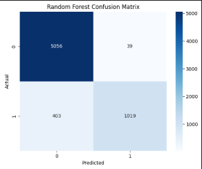

# 🧠 Credit Risk Classification – Task 1

This project focuses on building and comparing **classification models** to predict credit risk.  
We applied data preprocessing, handled missing values, scaled features, and trained multiple machine learning models.

---

## ⚙️ Steps Covered

1. **Exploratory Data Analysis (EDA)**  
   - Checked target balance  
   - Correlation heatmap  
   - Outlier detection  

2. **Data Preprocessing**  
   - Missing value treatment (`loan_int_rate`, `person_emp_length`)  
   - Outlier handling  
   - Feature scaling & encoding categorical features  

3. **Model Training**  
   - Logistic Regression (baseline model)  
   - Decision Tree Classifier  
   - Random Forest Classifier  

4. **Evaluation Metrics**  
   - Confusion Matrix  
   - Classification Report (Precision, Recall, F1-Score)  
   - ROC-AUC Score  

---

## 📊 Results Overview

| Model                | Accuracy | Precision | Recall   | F1-score | ROC-AUC |
|-----------------------|----------|-----------|----------|----------|---------|
| Logistic Regression   | 0.814    | 0.552     | 0.779    | 0.646    | 0.871   |
| Decision Tree         | 0.890    | 0.739     | 0.767    | 0.753    | 0.846   |
| Random Forest         | 0.932    | 0.963     | 0.717    | 0.822    | 0.931   |

---

## 📈 Visualizations

### 🔹 Confusion Matrices
- Logistic Regression  
    

- Decision Tree  
    

- Random Forest  
    

---

### 🔹 ROC Curves
- Comparison between Logistic Regression, Decision Tree, and Random Forest  
    

---

### 🔹 Model Performance Comparison
- Accuracy & F1-score comparison across models  
    

---

## 🛠️ How to Run

```bash
jupyter notebook Credit_Scoring_Model.ipynb
